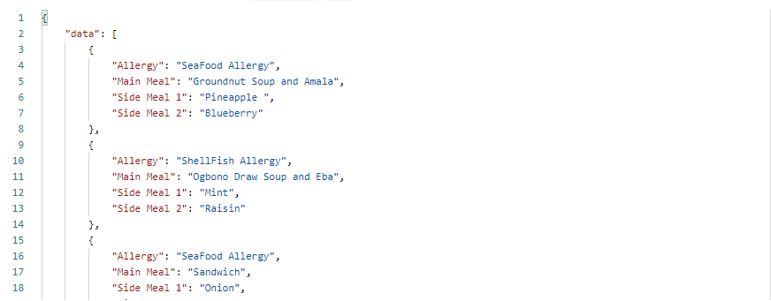
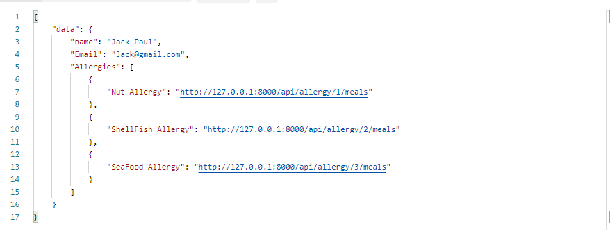
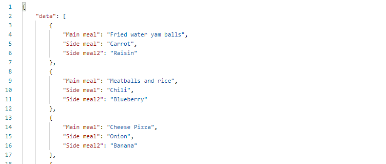
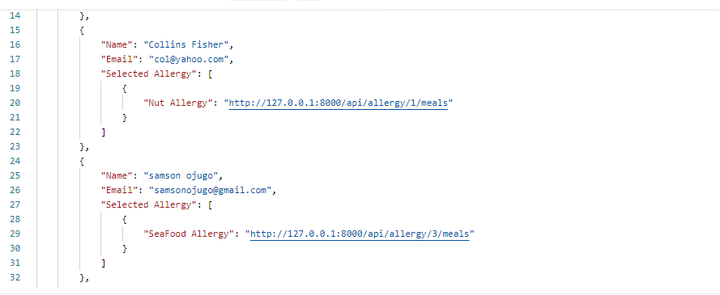

<h3>Meal Recommendation System REST API</h3>

Here is a Meal Recommendation System REST API that operate on three Allergies

<ul>
<li>Nut Allergy</li>
<li>ShellFish Allergy</li>
<li>SeaFood Allergy</li>
</ul>

The system already contains 10 users. Every user on the system is expected to pick their allergy from the Allergies operated on the system.

The system recommend meals according to the allergy picked by a user. The meals recommended include the Main Meal and two side meals.   The system can also fetch meal recommendations for more than one user at a time(The system fetch meal recomendation for users that have already picked an allergy). Users can have more than one allergy. 

Laravel was use in this project because is a comprehensive framework suitable for any kind of web development, is logically structured, and enjoys strong community support.</>

<h4>How to use the API</h4>

Different Endpoint was created for each task.

Start by Migrating Tables to your database and run Seeder for Fake Meals (you can as well insert your different meals by inserting on the Meal Table). Insert the different allergy on the Allergy table and also insert users on the MealUser Table

<ul>
<li>Fetch all meals with their Allergy <a href="https://mealrecommendation.herokuapp.com/api/allmeals">https://mealrecommendation.herokuapp.com/api/allmeals</a></li>

<li>User to select Allergy and get meal recommendation <a href="https://mealrecommendation.herokuapp.com/api/user/1/allergy">https://mealrecommendation.herokuapp.com/api/user/1/allergy</a> <b>NOTE: You can change the user_id ranging from 1-10 to see different user</b></li>

<li>Fetch meal recommendations for more than one user at a time <a href="https://mealrecommendation.herokuapp.com/api/users/allergy">https://mealrecommendation.herokuapp.com/api/users/allergy</a> <b>Hint: Users and their different allergy </b></li>

</ul>
